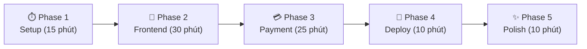
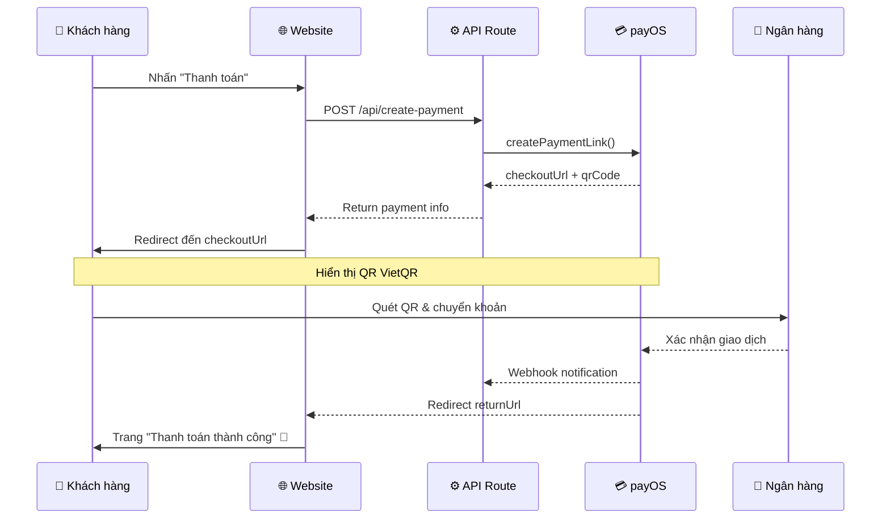

# 🚀 Kế Hoạch Vibe Code: Website Bán Hàng + Thanh Toán payOS

> **Môn:** Thanh toán trong TMĐT  
> **Thời gian:** ~1h30 (2 người)  
> **Tech Stack:** Next.js + payOS + Vercel  
> **Loại shop:** Thời trang / Phụ kiện

---

## 📋 Tổng Quan Chiến Lược



---

## 🧑‍🤝‍🧑 Phân Công 2 Người

| Task | Người A (Frontend) | Người B (Backend + Payment) |
|------|--------------------|-----------------------------|
| Phase 1 | Setup Next.js, install deps | Đăng ký payOS, lấy API keys |
| Phase 2 | UI trang chủ, sản phẩm | API routes, data models |
| Phase 3 | Trang checkout, QR display | Tích hợp payOS SDK, webhook |
| Phase 4 | Test flow | Deploy Vercel |
| Phase 5 | Animations, polish | Viết tài liệu demo |

---

## ⏱️ Phase 1: Setup (15 phút)

### Người B: Đăng ký payOS (làm đầu tiên!)

> [!IMPORTANT]
> Bước này phải làm **TRƯỚC TIÊN** vì cần chờ xác thực.

1. Truy cập [my.payos.vn](https://my.payos.vn) → Đăng ký tài khoản
2. Xác thực bằng **CCCD** (chụp 2 mặt)
3. Tạo **Kênh thanh toán** (Payment Channel)
4. Lấy 3 thông tin quan trọng:
   - `CLIENT_ID`
   - `API_KEY` 
   - `CHECKSUM_KEY`
5. Lưu vào file `.env.local`

```env
PAYOS_CLIENT_ID=your_client_id
PAYOS_API_KEY=your_api_key
PAYOS_CHECKSUM_KEY=your_checksum_key
```

### Người A: Khởi tạo dự án Next.js

```bash
# Tạo project Next.js
npx -y create-next-app@latest ./ --typescript --tailwind --eslint --app --src-dir --import-alias "@/*" --use-npm

# Cài đặt dependencies
npm install @payos/node
```

> [!NOTE]
> Dùng TailwindCSS ở đây vì Next.js tích hợp sẵn và nhanh hơn khi vibe code.

### Cấu trúc thư mục mục tiêu:

```
src/
├── app/
│   ├── page.tsx              # Trang chủ - danh sách sản phẩm
│   ├── layout.tsx            # Layout chung
│   ├── globals.css           # Global styles
│   ├── product/[id]/
│   │   └── page.tsx          # Chi tiết sản phẩm
│   ├── cart/
│   │   └── page.tsx          # Giỏ hàng
│   ├── checkout/
│   │   └── page.tsx          # Trang thanh toán
│   ├── payment/
│   │   ├── success/
│   │   │   └── page.tsx      # Thanh toán thành công
│   │   └── cancel/
│   │       └── page.tsx      # Thanh toán bị hủy
│   └── api/
│       ├── create-payment/
│       │   └── route.ts      # API tạo link thanh toán
│       └── webhook/
│           └── route.ts      # Webhook nhận thông báo từ payOS
├── components/
│   ├── Navbar.tsx
│   ├── ProductCard.tsx
│   ├── CartDrawer.tsx
│   └── Footer.tsx
├── lib/
│   ├── payos.ts              # payOS instance
│   └── products.ts           # Data sản phẩm (mock)
└── context/
    └── CartContext.tsx        # Cart state management
```

---

## 🎨 Phase 2: Frontend (30 phút)

### 2.1 Data sản phẩm mock (`src/lib/products.ts`)

```typescript
export interface Product {
  id: number;
  name: string;
  price: number;
  image: string;
  category: string;
  description: string;
  sizes: string[];
  colors: string[];
}

export const products: Product[] = [
  {
    id: 1,
    name: "Áo Thun Oversize Premium",
    price: 299000,
    image: "https://images.unsplash.com/photo-1521572163474-6864f9cf17ab?w=500",
    category: "Áo",
    description: "Áo thun oversize chất cotton 100%, form rộng thoải mái",
    sizes: ["S", "M", "L", "XL"],
    colors: ["Đen", "Trắng", "Be"]
  },
  {
    id: 2,
    name: "Quần Jeans Slim Fit",
    price: 450000,
    image: "https://images.unsplash.com/photo-1542272454315-4c01d7abdf4a?w=500",
    category: "Quần",
    description: "Quần jeans slim fit co giãn, tôn dáng",
    sizes: ["28", "29", "30", "31", "32"],
    colors: ["Xanh đậm", "Xanh nhạt"]
  },
  {
    id: 3,
    name: "Túi Tote Canvas",
    price: 189000,
    image: "https://images.unsplash.com/photo-1544816155-12df9643f363?w=500",
    category: "Phụ kiện",
    description: "Túi tote canvas bền đẹp, thân thiện môi trường",
    sizes: ["One Size"],
    colors: ["Trắng kem", "Đen"]
  },
  // Thêm 3-5 sản phẩm nữa...
];
```

### 2.2 Cart Context (`src/context/CartContext.tsx`)

> **Prompt gợi ý cho AI Studio:**
> 
> *"Tạo CartContext cho React/Next.js với TypeScript, dùng useReducer. Cần các actions: ADD_TO_CART, REMOVE_FROM_CART, UPDATE_QUANTITY, CLEAR_CART. Mỗi cart item có: product (Product type), quantity, selectedSize, selectedColor. Persist vào localStorage."*

### 2.3 Trang chủ - Grid sản phẩm

> **Prompt gợi ý:**
> 
> *"Tạo trang chủ Next.js App Router cho shop thời trang. Dark theme premium với gradient tím-xanh. Grid responsive 4 cột. Mỗi ProductCard có: ảnh, tên, giá (format VND), badge category, hover animation scale, nút 'Thêm vào giỏ'. Header có logo, nav links, cart icon với badge count. Hero section với text gradient và CTA button."*

### 2.4 Trang chi tiết sản phẩm

> **Prompt gợi ý:**
> 
> *"Tạo trang chi tiết sản phẩm với layout 2 cột: ảnh lớn bên trái, thông tin bên phải. Cho chọn size bằng button group, chọn màu bằng color circles. Nút 'Thêm vào giỏ' to, gradient. Hiện giá format VND. Breadcrumb navigation."*

### 2.5 Trang giỏ hàng + Checkout

> **Prompt gợi ý:**
> 
> *"Tạo trang giỏ hàng: danh sách items (ảnh thumbnail, tên, size, color, quantity selector, nút xóa, giá). Summary section với tổng tiền, phí ship, tổng cộng. Nút 'Thanh toán' redirect đến /checkout. Trang checkout: form thông tin (tên, SĐT, email, địa chỉ) + order summary + nút 'Thanh toán qua payOS'."*

---

## 💳 Phase 3: Tích hợp payOS (25 phút)

> [!IMPORTANT]
> Đây là phần **QUAN TRỌNG NHẤT** cho bài tập môn Thanh toán TMĐT!

### 3.1 Khởi tạo payOS instance (`src/lib/payos.ts`)

```typescript
import PayOS from "@payos/node";

const payos = new PayOS(
  process.env.PAYOS_CLIENT_ID as string,
  process.env.PAYOS_API_KEY as string,
  process.env.PAYOS_CHECKSUM_KEY as string
);

export default payos;
```

### 3.2 API tạo link thanh toán (`src/app/api/create-payment/route.ts`)

```typescript
import { NextRequest, NextResponse } from "next/server";
import payos from "@/lib/payos";

export async function POST(req: NextRequest) {
  try {
    const body = await req.json();
    const { orderCode, amount, description, buyerName, buyerPhone, items } = body;

    // Tạo payment link qua payOS
    const paymentData = {
      orderCode: orderCode || Number(String(Date.now()).slice(-6)),
      amount: amount,
      description: description || "Thanh toan don hang",
      buyerName: buyerName,
      buyerPhone: buyerPhone,
      items: items.map((item: any) => ({
        name: item.name,
        quantity: item.quantity,
        price: item.price,
      })),
      returnUrl: `${process.env.NEXT_PUBLIC_BASE_URL}/payment/success`,
      cancelUrl: `${process.env.NEXT_PUBLIC_BASE_URL}/payment/cancel`,
    };

    const paymentLink = await payos.createPaymentLink(paymentData);

    return NextResponse.json({
      success: true,
      checkoutUrl: paymentLink.checkoutUrl,
      orderCode: paymentLink.orderCode,
      qrCode: paymentLink.qrCode,
    });
  } catch (error: any) {
    console.error("Payment error:", error);
    return NextResponse.json(
      { success: false, message: error.message },
      { status: 500 }
    );
  }
}
```

### 3.3 Webhook nhận thông báo (`src/app/api/webhook/route.ts`)

```typescript
import { NextRequest, NextResponse } from "next/server";
import payos from "@/lib/payos";

export async function POST(req: NextRequest) {
  try {
    const body = await req.json();
    
    // Verify webhook signature
    const webhookData = payos.verifyPaymentWebhookData(body);
    
    if (webhookData.code === "00") {
      // Thanh toán thành công
      console.log("Payment success:", webhookData);
      // TODO: Cập nhật trạng thái đơn hàng trong DB
    }

    return NextResponse.json({ success: true });
  } catch (error: any) {
    console.error("Webhook error:", error);
    return NextResponse.json(
      { success: false, message: error.message },
      { status: 500 }
    );
  }
}
```

### 3.4 Flow thanh toán trên Frontend



### 3.5 Trang thanh toán thành công (`src/app/payment/success/page.tsx`)

> **Prompt gợi ý:**
> 
> *"Tạo trang thanh toán thành công: icon check animation, text 'Cảm ơn bạn! Đơn hàng đã được đặt thành công', hiện mã đơn hàng, nút 'Tiếp tục mua sắm'. Confetti animation. Green gradient theme."*

### 3.6 Gọi API thanh toán từ Checkout page

```typescript
const handlePayment = async () => {
  setLoading(true);
  try {
    const response = await fetch("/api/create-payment", {
      method: "POST",
      headers: { "Content-Type": "application/json" },
      body: JSON.stringify({
        orderCode: Number(String(Date.now()).slice(-6)),
        amount: totalAmount,
        description: `DH${Date.now()}`,
        buyerName: formData.name,
        buyerPhone: formData.phone,
        items: cartItems.map(item => ({
          name: item.product.name,
          quantity: item.quantity,
          price: item.product.price,
        })),
      }),
    });

    const data = await response.json();
    
    if (data.success) {
      // Chuyển hướng đến trang thanh toán payOS
      window.location.href = data.checkoutUrl;
    }
  } catch (error) {
    console.error("Error:", error);
    alert("Có lỗi xảy ra, vui lòng thử lại!");
  } finally {
    setLoading(false);
  }
};
```

---

## 🚀 Phase 4: Deploy Vercel (10 phút)

### Bước 1: Push code lên GitHub

```bash
git init
git add .
git commit -m "feat: ecommerce website with payOS payment"
git remote add origin https://github.com/YOUR_USERNAME/fashion-store.git
git push -u origin main
```

### Bước 2: Deploy lên Vercel

1. Truy cập [vercel.com](https://vercel.com) → Import từ GitHub
2. Chọn repo vừa push
3. **Quan trọng:** Thêm Environment Variables:
   ```
   PAYOS_CLIENT_ID=xxx
   PAYOS_API_KEY=xxx
   PAYOS_CHECKSUM_KEY=xxx
   NEXT_PUBLIC_BASE_URL=https://your-app.vercel.app
   ```
4. Click Deploy → Đợi ~2 phút

### Bước 3: Cấu hình Webhook URL trên payOS

> [!WARNING]
> Phải cập nhật URL webhook sau khi deploy!

1. Vào [my.payos.vn](https://my.payos.vn) → Kênh thanh toán
2. Cập nhật **Webhook URL**: `https://your-app.vercel.app/api/webhook`
3. Cập nhật **Return URL**: `https://your-app.vercel.app/payment/success`
4. Cập nhật **Cancel URL**: `https://your-app.vercel.app/payment/cancel`

---

## ✨ Phase 5: Polish (10 phút)

### Checklist cuối:

- [ ] Test flow mua hàng end-to-end
- [ ] Kiểm tra responsive mobile
- [ ] Thêm loading states cho nút thanh toán
- [ ] Format giá tiền VND đúng (dùng `Intl.NumberFormat`)
- [ ] Thêm toast notifications (thêm vào giỏ thành công)
- [ ] Screenshot/quay video demo cho thuyết trình

### Format giá VND helper:

```typescript
export const formatVND = (amount: number): string => {
  return new Intl.NumberFormat('vi-VN', {
    style: 'currency',
    currency: 'VND'
  }).format(amount);
};
```

---

## 📝 Ghi Chú Quan Trọng Cho Thuyết Trình

### Các điểm cần nhấn mạnh:

1. **Quy trình thanh toán VietQR:**
   - Khách chọn sản phẩm → Thêm vào giỏ → Checkout
   - Tạo payment link qua payOS API
   - Redirect đến trang thanh toán payOS → QR code VietQR
   - Khách quét QR bằng app ngân hàng → Chuyển khoản
   - payOS xác nhận → Webhook thông báo → Cập nhật đơn hàng

2. **Ưu điểm payOS:**
   - Miễn phí 100% (không phí giao dịch, setup, duy trì)
   - Hỗ trợ VietQR - tiêu chuẩn QR thanh toán quốc gia
   - Xác nhận thanh toán real-time qua webhook
   - SDK Node.js chính thức, dễ tích hợp
   - Chỉ cần CCCD để đăng ký

3. **So sánh với phương thức truyền thống:**

| Tiêu chí | Truyền thống | payOS |
|----------|-------------|-------|
| Xác nhận | Thủ công (check bank) | Tự động (webhook) |
| Tốc độ | Phút → giờ | Real-time (giây) |
| Chi phí | Phí cổng thanh toán | Miễn phí |
| Tích hợp | Phức tạp | SDK sẵn |
| Đối soát | Thủ công | Tự động |

4. **Bảo mật:**
   - HMAC SHA-256 signature verification
   - Webhook data integrity check
   - API key không exposed ra frontend

---

## 🎯 Prompt Tổng Hợp Cho AI Studio

Dưới đây là **prompt tổng hợp** bạn có thể paste vào Google AI Studio hoặc tool AI khác để generate code nhanh:

> *"Tạo cho tôi một website bán hàng thời trang bằng Next.js 14 App Router + TypeScript + TailwindCSS. Theme dark premium với gradient tím-xanh (#7c3aed → #2563eb). Cần có:*
> 
> *1. Trang chủ: Hero section + grid 8 sản phẩm thời trang (áo, quần, phụ kiện) với giá VND*
> *2. Trang chi tiết sản phẩm: ảnh lớn + chọn size/color + nút mua*
> *3. Giỏ hàng: thêm/xóa/sửa số lượng + tổng tiền*
> *4. Checkout: form thông tin + nút thanh toán*
> *5. API route /api/create-payment sử dụng @payos/node SDK để tạo payment link*
> *6. API route /api/webhook để nhận thông báo thanh toán từ payOS*
> *7. Trang payment/success và payment/cancel*
> *8. Cart state dùng React Context + localStorage*
> *9. Format giá VND, responsive, hover animations*
> *10. Tất cả sử dụng ảnh từ Unsplash cho sản phẩm"*

---

> [!TIP]
> **Mẹo vibe code nhanh:** Khi dùng AI Studio, hãy generate từng phần một (không generate cả project 1 lần). Bắt đầu từ data → context → components → pages → API routes. Fix lỗi ngay khi phát hiện, đừng tích lũy.
